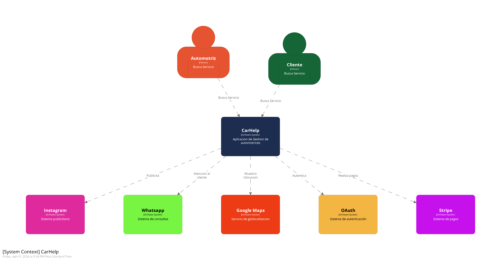

# DriveSmart - Report

  

# Universdiad Peruana de Ciencias Aplicadas

# INGENIERÍA DE SISTEMAS DE SOFTWARE
### Ciclo: 5
## CURSO: SI730 Aplicaciones Web | SECCIÓN SW51
 Profesor: Tinoco Licas, Juan Carlos
 
# Proyecto de curso
## Informe del TF
#### StartUp: DriveSmart
#### Producto: CarHelp

### Integrantes:
| Integrantes | Codigo |
|-------------|--------|
| Altamirano Saenz, Jorge Armando  | U202215888 |
| De la Piedra Quintanilla, Erwin Miquel | U202112179 |
| Guimaraes Escalante, Carlos Eduardo | U202210364 |
| Gutierrez Zumaeta, Manuel Alonso | U202112353 |
| Montes Figueroa, Juan Eduardo | U202210775 |

#### Ciclo 2024-01
##### Abril, 2024

---

# Registro de Versiones del informe
| Version | Fecha | Autor | Descripcion de Modificacion |
| ----------- | ----------- | ----------- | ----------- |
| 0.0 | 28/03/2024 |Grupo 1 |Se crea el documento |
- - -
# Project Report Collaboration Insights
[URL del repositorio](https://github.com/AplicacionesWeb-DriveSmart/FinalProjectDocument/blob/main/README.md)

(Imagenes de los commits cada entrega)
- - -
# Contenido

[Student Outcome](#student-outcome)

[Capítulo I: Introducción](#capítulo-i-introducción)

[1.1 Startup Profile](#11-startup-profile)  
[1.1.1. Descripción de la Startup](#111-descripción-de-la-startup) 

[1.1.2. Perfiles de integrantes del equipo](#112-perfiles-de-integrantes-del-equipo)  

[1.2. Solution Profile](#12-solution-profile)  
[1.2.1 Antecedentes y problemática](#121-antecedentes-y-problemática)  
[1.2.2 Lean UX Process.](#122-lean-ux-process)  
[1.2.2.1. Lean UX Problem Statements.](#1221-lean-ux-problem-statements)  
[1.2.2.2. Lean UX Assumptions.](#1222-lean-ux-assumptions)  
[1.2.2.3. Lean UX Hypothesis Statements.](#1223-lean-ux-hypothesis-statements)  
[1.2.2.4. Lean UX Canvas.](#1224-lean-ux-canvas)  

[1.3. Segmentos objetivo.](#13-segmentos-objetivo)  

[Capítulo II: Requirements Elicitation & Analysi](#capítulo-ii-requirements-elicitation--analysis)  

[2.1. Competidores](#21-competidores)  
[2.1.1. Análisis competitivo]()  
[2.1.2. Estrategias y tácticas frente a competidores](#211-análisis-competitivo)  

[2.2. Entrevistas](#22-entrevistas)  
[2.2.1. Diseño de entrevistas](#221-diseño-de-entrevistas)    
[2.2.3. Análisis de entrevistas](#223-análisis-de-entrevistas)  

[2.3. Needfinding](#23-needfinding)  
[2.3.1. User Personas](#231-user-personas)  
[2.3.2. User Task Matrix](#232-user-task-matrix)  
[2.3.3. User Journey Mapping](#233-user-journey-mapping)  
[2.3.4. Empathy Mapping](#234-empathy-mapping)  
[2.3.5. As-is Scenario Mapping](#235-as-is-scenario-mapping) 

[2.4. Ubiquitous Language](#24-ubiquitous-language)  

[Capítulo III: Requirements Specificatio](#capítulo-iii-requirements-specification)  

[3.1. To-Be Scenario Mapping](#31-to-be-scenario-mapping)  

[3.2. User Stories](#32-user-stories)  

[3.3. Impact Mapping](#33-impact-mapping)  

[3.4. Product Backlog](#34-product-backlog)  

[Capítulo IV: Product Design](#capítulo-iv-product-design)  

[4.1. Style Guidelines](#41-style-guidelines)  
[4.1.1. General Style Guidelines](#411-general-style-guidelines)  
[4.1.2. Web Style Guidelines](#412-web-style-guidelines)  

[4.2. Information Architecture](#42-information-architecture)  
[4.2.1. Organization Systems](#421-organization-systems)  
[4.2.2. Labeling Systems](#422-labeling-systems)  
[4.2.3. SEO Tags and Meta Tag](#423-seo-tags-and-meta-tags)  
[4.2.4. Searching Systems](#424-searching-systems)   
[4.2.5. Navigation Systems](#425-navigation-systems)  

[4.3. Landing Page UI Design](#43-landing-page-ui-design)   
[4.3.1. Landing Page Wireframe](#431-landing-page-wireframe)  
[4.3.2. Landing Page Mock-up](#432-landing-page-mock-up) 

[4.4. Web Applications UX/UI Design](#44-web-applications-uxui-design)  
[4.4.1. Web Applications Wireframes](#441-web-applications-wireframes)  
[4.4.2. Web Applications Wireflow Diagrams](#442-web-applications-wireflow-diagrams)  
[4.4.2. Web Applications Mock-ups](#442-web-applications-mock-ups)   
[4.4.3. Web Applications User Flow Diagrams](#443-web-applications-user-flow-diagrams)  

[4.5. Web Applications Prototyping](#45-web-applications-prototyping)  

[4.6. Domain-Driven Software Architecture](#46-domain-driven-software-architecture)  
[4.6.1. Software Architecture Context Diagram](#461-software-architecture-context-diagram)  
[4.6.2. Software Architecture Container Diagrams](#462-software-architecture-container-diagrams)  
[4.6.3. Software Architecture Components Diagrams](#463-software-architecture-components-diagrams)  

[4.7. Software Object-Oriented Design](#47-software-object-oriented-design)  
[4.7.1. Class Diagrams](#471-class-diagrams)  
[4.7.2. Class Dictionary](#472-class-dictionary)  

[4.8. Database Design](#48-database-design)  
[4.8.1. Database Diagram](#481-database-diagram)  

[Capítulo V: Product Implementation, Validation & Deploymen](#capítulo-v-product-implementation-validation--deployment)  

[5.1. Software Configuration Management](#51-software-configuration-management)  
[5.1.1. Software Development Environment Configuration](#511-software-development-environment-configuration)  
[5.1.2. Source Code Management](#512-source-code-management)  
[5.1.3. Source Code Style Guide & Conventions](#513-source-code-style-guide--conventions)  
[5.1.4. Software Deployment Configuration](#514-software-deployment-configuration)  

[5.2. Landing Page, Services & Applications Implementation](#52-landing-page-services--applications-implementation)  
[5.2.X. Sprint ](#52x-sprint-n)  
[5.2.X.1. Sprint Planning n](#52x1-sprint-planning-n)  
[5.2.X.2. Sprint Backlog n](#52x2-sprint-backlog-n)  
[5.2.X.3. Development Evidence for Sprint Review](#52x3-development-evidence-for-sprint-review)  
[5.2.X.4. Testing Suite Evidence for Sprint Review](#52x4-testing-suite-evidence-for-sprint-review)  
[5.2.X.5. Execution Evidence for Sprint Review](#52x5-execution-evidence-for-sprint-review)  
[5.2.X.6. Services Documentation Evidence for Sprint Review](#52x6-services-documentation-evidence-for-sprint-review)  
[5.2.X.7. Software Deployment Evidence for Sprint Review](#52x7-software-deployment-evidence-for-sprint-review)  
[5.2.X.8. Team Collaboration Insights during Sprint](#52x8-team-collaboration-insights-during-sprint)  

[5.3. Validation Interviews](#53-validation-interviews)  
[5.3.1. Diseño de Entrevistas](#531-diseño-de-entrevistas)  
[5.3.2. Registro de Entrevistas](#532-registro-de-entrevistas)  
[5.3.3. Evaluaciones según heurísticas](#533-evaluaciones-según-heurísticas)  

[5.4. Video About-the-Product](#54-video-about-the-product)  

[Conclusiones](#conclusiones)  

[Conclusiones y recomendaciones](#conclusiones-y-recomendaciones)  

[Video About-the-Team](#video-about-the-team)  

[Bibliografía](#bibliografía)  

[Anexos](#anexos)  

- - -

# Capítulo I: Introducción
## 1.1 Startup Profile.
En esta sección se presenta la descripción del startup y los perfiles de los miembros del equipo.
### 1.1.1. Descripción del startup.
La startup, presentada con el nombre de "DriveSmart", se centra en ofrecer una solución tecnológica avanzada para mejorar la gestión y la comunicación con los clientes en el sector automotriz del Perú. Para ello, se ha desarrollado una aplicación especializada que permite llevar un registro exhaustivo de los clientes de las compañías automotrices, incluyendo tanto sus datos personales como los detalles de sus vehículos. Esta aplicación proporciona a los clientes información detallada sobre las próximas revisiones técnicas de sus vehículos, así como una comunicación fluida con la empresa para estar al tanto de los tiempos y precios de cada intervención, y para conocer los recursos necesarios de antemano.
Misión: Brindar a las compañías automotrices herramientas avanzadas de gestión y comunicación que optimicen la experiencia del cliente, permitiendo un servicio más eficiente, transparente y personalizado. 
Visión: Nos visualizamos como líderes en la transformación digital del sector automotriz peruano, siendo reconocidos por nuestra excelencia en la entrega de soluciones tecnológicas de vanguardia que impulsan la satisfacción del cliente y el crecimiento sostenible de las empresas del rubro. Aspiramos a ser el socio estratégico preferido de las compañías automotrices en su camino hacia la innovación y la excelencia operativa.

Logotipo de la Startup:

  

Logotipo del servicio:

  

### 1.1.2. Perfiles de los integrantes del equipo.

<table border="1">
  <tr>
    <td><strong>Carlos Eduardo Guimaraes Escalante (U202210364)</strong></td>
    <td>Soy estudiante de la carrera de Ingeniería de Software, estoy cursando el tercer ciclo de mi carrera y tengo 17 años. Soy una persona responsable y puntual, por lo que me gusta terminar y presentar los trabajos en los tiempos establecidos. Siempre me ha gustado la innovación y la creación de nuevas ideas. Estoy capacitado en algunos  temas de edición de videos, y me considero bueno en programación. Voy a aportar al grupo de manera proactiva e intentaré aportar ideas que ayuden a mejorar el trabajo, siempre intentando mantener un ambiente positivo dentro del área de trabajo.
    </td>
    <td>

  
</td>
  </tr>
  <tr>
    <td><strong>Altamirano Saenz, Jorge Armando (U202215888)</strong></td>
    <td>Me llamo Jorge Altamirano, tengo 19 años. Tengo conocimientos en programación en los lenguajes de C++, Python, Java y C# básico.  Me considero una persona responsable e investigadora y creo que puedo aportar con ideas propias al equipo.
</td>
    <td>

  
</td>
  </tr>
  <tr>
    <td><strong>Montes Figueroa, Juan Eduardo (U202210775)</strong></td>
    <td>Mi nombre es Juan Montes, tengo 19 años, tengo conocimientos en C++, asimismo poseo conocimientos 
básicos en Java y también en diseño de imágenes tanto en 
aplicaciones complicadas como Photoshop hasta páginas webs que 
te dan funciones similares. Puedo aportar en el equipo con ideas, 
confianza y atención a los detalles.
</td>
    <td>

  
</td>
  </tr>
  <tr>
    <td><strong>Gutierrez Zumaeta, Manuel Alonso (U202112353)</strong></td>
    <td>Me llamo Manuel Gutierre, tengo 20 años, me gusta la fotografia y los videojuegos. Tambien tengo conocimientos en lenguajes de programacion como Python, C++, HTML, CSS y JavaScript. Considero que esto podria ayudar al equipo en el transcuso del curso, en la parte del desarrollo del aplicativo web, al igual al momento de hacer toda la documentacion correspondiente.</td>
    <td>

  
</td>
  </tr>
  <tr>
    <td><strong>De la Piedra Quintanilla, Erwin Miquel (U202112179)</strong></td>
    <td>Me llamo Miquel De la Piedra, tengo 20 años y me gusta mucho el cine, en especial las críticas de esta. Posee conocimientos relacionados a la programación en C++, Python, HTML y CSS, considero que estos conocimientos ayudarán a la realización de este trabajo, además de mejorar nuestros métodos de organización y trabajo en equipo.</td>
    <td>

  
</td>
  </tr>
</table>

## 1.2. Solution Profile.
### 1.2.1. Antecedentes y Problemática.

<u>What (Qué)</u>

¿Cuál es el problema?

El problema identificado radica en la deficiente gestión y organización de las empresas automotrices en Perú con respecto a la información de sus clientes, así como en la falta de canales efectivos de comunicación con los mismos. Esta situación conlleva a dificultades significativas durante la ejecución de procedimientos de reparación y mantenimiento vehicular.

<u>When (Cuando)</u>

¿Cuándo sucede el problema?

El problema surge durante el proceso de análisis de vehículos, donde se requiere acceder a datos tanto del vehículo como de su propietario, lo que puede resultar en dificultades para recopilar esta información de manera eficiente. Además, existe una carencia en la capacidad de obtener información sobre los tiempos y costos asociados con las revisiones, así como en establecer una comunicación directa con el cliente para proporcionar esta información de manera oportuna y precisa.

<u>Where (Dónde)</u>

¿A dónde se dirige?

El servicio está enfocado a brindar solución a todo tipo de empresas enfocadas en el sector automotriz en el Perú.

¿Dónde surge el problema?

El servicio proporcionado está diseñado para ofrecer una solución integral a todas las empresas dedicadas al sector automotriz en el Perú.

<u>Who (Quién)</u>

¿Quiénes están involucrados? ¿Quién lo utilizará?

Los usuarios encargados de gestionar el registro de información serán los técnicos especializados en el área automotriz. Utilizarán la aplicación para registrar y dar seguimiento a los vehículos de sus clientes. Por otro lado, los clientes serán los usuarios que interactúan con el sistema para registrar únicamente sus recorridos y obtener información sobre las necesidades y aspectos relevantes de sus vehículos cuando se encuentren en las automotrices. Estos datos permitirán a las automotrices y a sus clientes ahorrar tiempo y mejorar la gestión de los vehículos.

<u>Why (Por qué)</u>

¿Cuál es la causa del problema?

La causa principal del problema radica en la falta de experiencia de los miembros de las empresas automotrices, así como en su tendencia a conformarse con el uso de comunicaciones externas no formalizadas. Esto conduce a una comunicación ineficaz en la mayoría de los casos y a la aparición de una mayor cantidad de problemas.

¿Cuáles son las 2H?

<u>How (Cómo)</u>

¿Cómo se utilizará el producto?

El producto se emplea para gestionar el registro de vehículos y clientes, estableciendo así una base de datos para facilitar las revisiones técnicas de los automóviles. Posteriormente, esta plataforma servirá como medio para comunicar los diferentes tiempos y precios de las revisiones, adaptándose a las necesidades específicas de cada cliente.

¿Cómo lograremos desarrollar la correcta gestión de vehículos y clientes dentro de la plataforma?

Los técnicos y administradores accederán a la aplicación web mediante un navegador. Desde esta interfaz, podrán registrar datos relacionados con los clientes y luego agregar información sobre los vehículos correspondientes a esos clientes. Todos los datos se almacenarán de forma segura en una base de datos protegida.

<u>How much (Cuánto)</u>

¿Cuál es la magnitud del problema?

La magnitud del problema radica en la falta de eficiencia y comunicación en la gestión de clientes por parte de las empresas automotrices en el Perú. Esto resulta en retrasos en las reparaciones, confusiones en los precios y tiempos de intervención, así como en la necesidad de una comunicación más efectiva entre las partes involucradas. Esta deficiencia afecta tanto a las empresas automotrices como a los clientes, lo que resulta en una experiencia insatisfactoria y una menor eficiencia en el servicio.

¿Qué porcentaje del personal de la industria automotriz se verá beneficiado por el servicio?

La aplicación está diseñada para ser utilizada por múltiples técnicos y propietarios de vehículos, con un número de usuarios que puede variar considerablemente. Sin embargo, se estima que aproximadamente el 40% de los usuarios se beneficiarán directamente de su uso.

### 1.2.2. Lean UX Process.

#### 1.2.2.1. Lean UX Problem Statements.

Problem Statement:
El propósito de CarHelp Pro es brindar a las automotrices un sistema que les permita llevar un mejor manejo y registro de información de sus clientes y vehículos, dándoles la facilidad de realizar mejor sus revisiones al tener a la mano esta información.

En el mercado automotriz peruano, las empresas enfrentan desafíos significativos en la gestión eficiente de clientes y la comunicación efectiva con ellos. La falta de sistemas centralizados y la dependencia de comunicaciones informales, como llamadas telefónicas y mensajes privados dispersos, conducen a una experiencia inadecuada tanto para los clientes como para las empresas. Esto resulta en retrasos en la programación de revisiones y reparaciones de vehículos, falta de transparencia en los costos y tiempos, y una mayor probabilidad de errores en la información del cliente y del vehículo. Además, la ausencia de un seguimiento efectivo de las necesidades de los clientes y de los servicios realizados puede conducir a una percepción deficiente de la calidad del servicio.

Como resultado, las automotrices se enfrentan a una pérdida de eficiencia operativa, mayores costos debido a retrabajos y reclamaciones, y a una disminución en la satisfacción del cliente. Esto último puede afectar negativamente la reputación de la empresa y su capacidad para retener y atraer nuevos clientes en un mercado altamente competitivo.

En este contexto, se necesita con urgencia una solución tecnológica que centralice la gestión de clientes y mejore la comunicación entre las automotrices y sus clientes. Esta solución debe proporcionar una plataforma intuitiva y segura que permita a las empresas registrar y actualizar fácilmente la información de los clientes y de sus vehículos, así como programar y rastrear las revisiones y reparaciones realizadas. Además, debe facilitar una comunicación transparente y oportuna con los clientes, brindando información precisa sobre los tiempos y costos de los servicios, así como recordatorios automáticos de mantenimiento.

¿Cómo podríamos gestionar de forma automatizada la información proveniente de los clientes y vehículos sin generar pérdidas de datos relevantes?

#### 1.2.2.2. Lean UX Assumptions.

<u>Business Assumptions:</u>

**Demanda del mercado:** Se asume que hay una demanda significativa en el mercado peruano para soluciones tecnológicas que mejoren la gestión y comunicación con los clientes en el sector automotriz.

**Disponibilidad de clientes potenciales:** Se asume que existen suficientes empresas automotrices en Perú que estarían interesadas en adoptar una solución tecnológica para mejorar su gestión de clientes y operaciones.

**Interés en la adopción tecnológica:** Se asume que las empresas automotrices en Perú están dispuestas a adoptar nuevas tecnologías para mejorar su eficiencia operativa y la satisfacción del cliente.

**Acceso a la tecnología:** Se asume que las empresas automotrices en Perú tienen acceso adecuado a la infraestructura tecnológica necesaria para implementar y utilizar la solución propuesta.

**Necesidades de comunicación con los clientes:** Se asume que las empresas automotrices en Perú enfrentan desafíos significativos en la comunicación efectiva con sus clientes, lo que genera una demanda para una solución que facilite esta comunicación.

**Regulaciones y normativas:** Se asume que la startup cumplirá con todas las regulaciones y normativas relevantes del sector automotriz en Perú, incluidas aquellas relacionadas con la protección de datos y la privacidad del cliente.

**Competencia en el mercado:** Se asume que existen competidores potenciales en el mercado, tanto locales como internacionales, que ofrecen soluciones similares o alternativas para la gestión de clientes en el sector automotriz en Perú.

<u>Bussines Outcomes:</u>

Incremento en la eficiencia operativa y en la satisfacción del cliente para las empresas automotrices en Perú, como resultado de la implementación de la plataforma tecnológica. Esto se reflejará en una reducción en los tiempos de espera para los clientes, una mejor gestión de la comunicación y los registros, así como una mayor fidelización de los clientes.

<u>User Assumptions:</u>

¿Quién es el usuario?

Los usuarios son, los técnicos y administradores encargados del registro de de la empresa, además de sus mismo clientes al momento de hacer uso para mantener un seguimiento de sus vehículos.

¿Qué problemas tiene nuestro producto? ¿Resolver?

Un problema de la aplicación, es la falta de automatización de la aplicación para reconocer las necesidades del vehículo, en especial determinar las distancias recorridas, ya que el cliente debe ingresar de manera manual el kilometraje de sus propios automóviles,

¿Qué características son importantes?

Las características más relevantes del sistema incluyen un sistema de registro y seguimiento implementado por técnicos y administradores, mediante el cual se capturan y gestionan los datos de los clientes de manera eficiente. Se proporcionan herramientas y funcionalidades para la adición, gestión, actualización y eliminación ágil de perfiles de clientes en el sistema.
Además, se destacan las funcionalidades diseñadas para mantener a los clientes informados y actualizados respecto a sus vehículos. Esto se logra a través de medios de comunicación integrados como el chat y notificaciones automatizadas, que permiten una interacción fluida entre el usuario y el sistema. Estas características aseguran una comunicación efectiva y oportuna entre el cliente y el servicio, mejorando la experiencia general del usuario y la eficacia operativa del sistema.

¿Dónde encaja nuestro producto en su trabajo o vida?

El producto encaja en la mejora de gestión de las automotrices en sus clientes, a su vez en la vida de dichos clientes.

¿Cuándo y cómo es nuestro producto? ¿Usado?

El servicio será utilizado por los técnicos de la compañía, al momento de registrar los datos de sus clientes y al momento de necesitarlos para su uso, siendo también usados por sus clientes para determinar el tiempo y precio de sus reparaciones.

¿Cómo debe verse nuestro producto y cómo debe comportarse?

El producto debe mostrar una interfaz eficiente y sencilla para los trabajadores, que les brinde todas las facilidades para llevar un registro adecuado, mientras que para los clientes debe verse adicionalmente llamativo, para lograr captar la atención de estos. Finalmente, el comportamiento se dirige a los términos de privacidad y seguridad de datos personales de los usuarios así como de la automotriz.

<u>User Outcomes:</u>

Los técnicos y administradores de automotrices experimentarán una mayor facilidad y eficiencia en la gestión de clientes y registros, gracias a una interfaz intuitiva y funcionalidades avanzadas proporcionadas por la plataforma. Los clientes de las automotrices disfrutarán de una experiencia más conveniente y transparente, con acceso a información detallada sobre el estado de sus vehículos y una comunicación más clara y oportuna con la empresa automotriz.

<u>Feature Assumptions:</u>

**Creemos que** los usuarios desean recibir notificaciones automáticas sobre el estado de sus vehículos, incluyendo recordatorios de mantenimiento y alertas de posibles problemas mecánicos.

**Creemos que** que existe una necesidad clara de una comunicación más efectiva entre las empresas automotrices y sus clientes para facilitar la coordinación de servicios de mantenimiento y reparación de vehículos.

**Creemos que**  los usuarios requerirán una interfaz de usuario intuitiva que garantice una experiencia de uso fluida y eficiente durante su interacción recurrente con la aplicación.

#### 1.2.2.3. Lean UX Hypothesis Statements.

<u>Hypothesis Statement 01:</u>

**Creemos que** los técnicos supervisores y clientes de las automotrices estarán dispuestos a adoptar la aplicación para llevar un registro más eficiente y mantener una mejor comunicación con la compañía.

**Sabremos que** hemos tenido éxito.

**Cuando** aproximadamente el 80% de los usuarios objetivo haya adoptado la aplicación dentro del primer semestre desde su lanzamiento.

<u>Hypothesis Statement 02:</u>

**Creemos que** al facilitar una comunicación transparente y oportuna con los clientes sobre los tiempos y costos de los servicios de mantenimiento a través de nuestra plataforma, podemos aumentar la confianza del cliente en las automotrices y mejorar la percepción de la calidad del servicio ofrecido.

**Sabremos que** hemos tenido éxito.

**Cuando** se observe un incremento del 20% en la frecuencia de interacciones entre los trabajadores y clientes de automotriz mediante el uso de la plataforma.

<u>Hypothesis Statement 03:</u>

**Creemos que** al proporcionar a los técnicos y administradores de automotrices una plataforma intuitiva y segura para registrar y actualizar información de clientes y vehículos, podemos reducir la incidencia de errores en los datos y mejorar la precisión y confiabilidad de la información almacenada.

**Sabremos** que hemos tenido éxito.

**Cuando** al menos el 60% de las decisiones estratégicas tomadas por los administradores se fundamentan en los análisis proporcionados por la aplicación.

<u>Hypothesis Statement 04:</u>

**Creemos que** al simplificar y automatizar los procesos de programación de revisiones y reparaciones de vehículos a través de nuestra solución tecnológica, podemos reducir significativamente los tiempos de espera y los errores en la programación, lo que resultará en una mejora perceptible en la experiencia del cliente.

**Sabremos que** hemos tenido éxito.

**Cuando** se perciba una disminución del 70% de las quejas de los clientes al momento de utilizar el servicio.

#### 1.2.2.4. Lean UX Canvas.

  

## 1.3. Segmento objetivo.

Se han identificado dos segmentos objetivos:

**Técnicos/Administradores de Automotrices:** Este segmento está compuesto por profesionales encargados de la gestión de clientes y registros dentro de una automotriz. Actúan como representantes de la empresa automotriz en la aplicación y tienen acceso privilegiado a funciones avanzadas para la manipulación y gestión de registros.

**Clientes de Automotrices:** Este segmento incluye a los propietarios de vehículos que visitan las automotrices. Son los usuarios finales de la aplicación y se encargan de proporcionar información relevante para los registros. Además, reciben mensajes y notificaciones dentro de la aplicación relacionados con el estado de sus vehículos y otros servicios ofrecidos por la automotriz.

# Capítulo II: Requirements Elicitation & Analysis.

Para realizar el análisis competitivo hemos tomado en consideración competidores directos e indirectos:

- **Mitchell1**: Mitchell1 es una empresa líder en la industria automotriz que ofrece software y soluciones tecnológicas para talleres mecánicos y concesionarios de automóviles. Su producto principal, ProDemand, es un sistema de información de reparación que proporciona a los técnicos automotrices acceso a datos detallados sobre reparación y mantenimiento de vehículos, incluyendo diagramas de cableado, procedimientos de diagnóstico y otra información técnica esencial.  

  

- **ALLDATA**: AllData es otra empresa líder en la industria automotriz que proporciona software y soluciones tecnológicas para talleres mecánicos y profesionales del automóvil. Al igual que Mitchell1, AllData ofrece acceso a una amplia base de datos de información técnica sobre reparación y mantenimiento de vehículos. Sus productos incluyen diagramas de cableado, especificaciones de componentes, procedimientos de reparación, boletines técnicos y otra documentación útil para ayudar a los técnicos a diagnosticar y reparar vehículos de manera efectiva. 

  

- **Shop-Ware**: Shop-Ware es una empresa de software que ofrece una plataforma de gestión de talleres para la industria automotriz. Su plataforma integra una variedad de herramientas y funciones diseñadas para ayudar a los talleres mecánicos a administrar eficientemente sus operaciones diarias. Esto incluye funciones como programación de citas, gestión de órdenes de trabajo, seguimiento de inventario, facturación, gestión de clientes y más.  

  

### 2.1.1 Análisis competitivo

<table>
  <tr>
    <th colspan="6" valign="top">Competitive Analysis Landscape</th>
  </tr>
  <tr>
    <td colspan="2" valign="top">¿Por qué llevar a cabo este análisis?</td>
    <td colspan="4" valign="top">El objetivo de este análisis es identificar las características de los competidores y encontrar maneras de diferenciarnos.</td>
  </tr>
  <tr>
    <td colspan="2" rowspan="2" valign="top">Startup y Competidores</td>
    <td valign="top">Car Help</td>
    <td valign="top">Mitchell1</td>
    <td valign="top">ALLDATA</td>
    <td valign="top">Shop-Ware</td>
  </tr>
  <tr>
    <td valign="top"></td>
    <td valign="top"></td>
    <td valign="top"></td>
    <td valign="top"></td>
  </tr>
  <tr>
    <td rowspan="2" valign="top">Perfil</td>
    <td valign="top">Overview</td>
    <td valign="top">Plataforma de gestión de procesos para talleres de reparación de vehículos, centrada en simplificar operaciones y mejorar la experiencia del cliente.</td>
    <td valign="top">Ofrece soluciones de gestión de talleres para la industria automotriz.</td>
    <td valign="top">Software de gestión de talleres y bases de datos de información técnica para la industria automotriz.</td>
    <td valign="top">Plataforma de gestión de talleres basada en la nube diseñada específicamente para la industria automotriz.
</td>

  </tr>
  <tr>
    <td valign="top">Ventaja competitiva ¿Qué valor ofrece a los clientes?</td>
    <td valign="top">Integración de seguimiento de kilometraje y notificaciones automáticas, interfaz fácil de usar y enfoque centrado en el cliente</td>
    <td valign="top">Su experiencia en la industria y sus sólidas bases de datos técnicas son su principal ventaja competitiva.</td>
    <td valign="top">Su amplia base de datos de información técnica y su experiencia en la industria automotriz son su principal ventaja competitiva.</td>
    <td valign="top">Su principal ventaja competitiva radica en su enfoque en la tecnología de la nube y su capacidad para proporcionar herramientas intuitivas y eficientes para la gestión de talleres.</td>
  </tr>
  <tr>
    <td rowspan="2" valign="top">Perfil de Marketing</td>
    <td valign="top">Mercado objetivo</td>
    <td valign="top">Talleres de reparación de vehículos de todos los tamaños, enfocándose en mejorar la eficiencia y calidad del servicio.</td>
    <td valign="top">Talleres de reparación de vehículos de todos los tamaños.</td>
    <td valign="top">Talleres de reparación de vehículos de todos los tamaños y fabricantes de automóviles</td>
    <td valign="top">Talleres de reparación de vehículos de todos los tamaños, desde pequeños talleres independientes hasta grandes cadenas de servicios automotrices.</td>
  </tr>
  <tr>
    <td valign="top">Estrategias de marketing</td>
    <td valign="top">Marketing en línea, demostraciones de producto, participación en eventos de la industria y asociaciones estratégicas.</td>
    <td valign="top">Utilizan marketing directo, publicidad en línea y participación en ferias de la industria automotriz.</td>
    <td valign="top">Utilizan publicidad en línea, asociaciones con fabricantes de automóviles y distribuidores para promocionar sus productos</td>
    <td valign="top">Shop-Ware utiliza una combinación de marketing en línea, demostraciones de producto, participación en eventos de la industria y asociaciones estratégicas para promover sus soluciones.</td>
  </tr>
  <tr>
    <td rowspan="3" valign="top">Perfil de Producto</td>
    <td valign="top">Productos & Servicios</td>
    <td valign="top">Plataforma de gestión de procesos con seguimiento de kilometraje, notificaciones automáticas y estimaciones de reparación.</td>
    <td valign="top">Ofrecen ProDemand y Manager SE, bases de datos técnicas y software de gestión de talleres.</td>
    <td valign="top">Ofrecen bases de datos de información técnica y software de gestión de talleres.</td>
    <td valign="top">Ofrece una plataforma de gestión de talleres basada en la nube que incluye funciones como programación, estimación, facturación, seguimiento de inventario y comunicación con los clientes.</td>
  </tr>
  <tr>
    <td valign="top">Precios & Costos</td>
    <td valign="top">Varían según características y tamaño del taller, con opciones de suscripción mensual o anual.</td>
    <td valign="top">Varían según el producto y pueden incluir tarifas de suscripción o costos de licencia.</td>
    <td valign="top">Los precios varían según el producto y pueden incluir tarifas de suscripción mensuales o costos de licencia.</td>
    <td valign="top">Los precios varían según el tamaño del taller y las características específicas de la solución, con opciones de suscripción mensual o anual</td>
  </tr>
  <tr>
    <td valign="top">Canales de distribución (Web y/o Móvil)</td>
    <td valign="top">Principalmente a través de su sitio web oficial y asociaciones con distribuidores de la industria automotriz.
    </td>
    <td valign="top">Principalmente a través de su sitio web y distribuidores autorizados, con posibilidad de acceso móvil. </td>
    <td valign="top">Principalmente a través de su sitio web oficial y asociaciones con fabricantes de automóviles y distribuidores.</td>
    <td valign="top">Principalmente a través de su sitio web oficial y mediante asociaciones con distribuidores de la industria automotriz.</td>
  </tr>
  <tr>
    <td rowspan="4" valign="top">Análisis SWOT</td>
    <td valign="top">Fortalezas</td>
    <td valign="top">
        <ul>
          <li>Enfoque centrado en el cliente.</li>
          <li>Integración de tecnología para mejorar la eficiencia operativa.</li>
          <li>Facilidad de uso y accesibilidad de la plataforma.</li>
      </ul>
    </td>
    <td valign="top">
        <ul>
          <li>Experiencia en la industria</li>
          <li>Bases de datos técnicas sólidas.</li>
          <li>Buen soporte al cliente.</li>
      </ul>
    </td>
    <td valign="top">
        <ul>
          <li>Experiencia en la industria automotriz.</li>
          <li>Asociaciones estratégicas.</li>
        </ul>
    </td>
    <td valign="top">
        <ul>
        <li>Tecnología basada en la nube.</li>
        <li>Herramientas intuitivas y eficientes.</li>
        <li>Enfoque en mejorar la comunicación con los clientes.</li>
      </ul>
    </td>
  </tr>
  <tr>
    <td valign="top">Debilidades</td>
    <td valign="top">
        <ul>
          <li>Posible necesidad de educación sobre el uso del sistema para nuevos usuarios.</li>
          <li>Dependencia de la conectividad a Internet para acceder al sistema.</li>
        </ul>
    </td>
    <td valign="top">
        <ul>
        <li>Curva de aprendizaje para nuevos usuarios.</li>
        <li>Expansión geográfica.</li>
      </ul>
    </td>
    <td valign="top">
        <ul>
        <li>Curva de aprendizaje para nuevos usuarios.</li>
        <li>Posible dependencia de asociaciones con fabricantes de automóviles.</li>
      </ul>
    </td>
    <td valign="top">
        <ul>
        <li> Posible resistencia al cambio por parte de algunos talleres.</li>
        <li>Dependencia de la conectividad a Internet para acceder al sistema.</li>
      </ul>
    </td>
  </tr>
  <tr>
    <td valign="top">Oportunidades</td>
    <td valign="top">
        <ul>
          <li>Expansión a nuevos mercados geográficos.</li>
          <li>Desarrollo de nuevas características para satisfacer las necesidades emergentes de la industria automotriz.</li>
      </ul>
    </td>
    <td valign="top">
        <ul>
          <li>Expansión geográfica.</li>
          <li> Desarrollo de nuevas características.</li>
      </ul>
    </td>
    <td valign="top">
        <ul>
          <li>Expansión a nuevos mercados geográficos.</li>
          <li>Desarrollo de nuevas características y funcionalidades</li>
      </ul>
    </td>
    <td valign="top">
        <ul>
          <li>Expansión a nuevos mercados geográficos.</li>
          <li>Desarrollo de nuevas características para satisfacer las necesidades emergentes de la industria automotriz.</li>
      </ul>
    </td>
  </tr>
  <tr>
    <td valign="top">Amenazas</td>
    <td valign="top">
        <ul>
          <li>Competencia creciente en el mercado de soluciones de gestión de talleres.</li>
          <li>Cambios en las tendencias tecnológicas que podrían afectar la demanda de productos y servicios</li>
      </ul>
    </td>
    <td valign="top">
        <ul>
          <li>Competencia creciente.</li>
          <li>Cambios tecnológicos.</li>
      </ul>
    </td>
    <td valign="top">
        <ul>
          <li>Competencia creciente en el mercado de soluciones de gestión de talleres.</li>
          <li>Cambios en las preferencias del cliente y en la tecnología.</li>
      </ul>
    </td>
    <td valign="top">
        <ul>
          <li>Competencia creciente en el mercado de soluciones de gestión de talleres.</li>
          <li>Cambios en las tendencias tecnológicas que podrían afectar la demanda de productos y servicios de Shop-Ware.</li>
      </ul>
    </td>
  </tr>
</table>

### 2.1.2. Estrategias y tácticas frente a competidores.

**Estrategia 1: Desarrollo de Capacitación Personalizada**

  - Táctica: Ofrecer capacitación personalizada a los talleres sobre cómo utilizar eficazmente nuestra plataforma de gestión de procesos.

  - Explicación: Al proporcionar capacitación personalizada, podemos asegurarnos de que los talleres comprendan completamente todas las características y funcionalidades de nuestra plataforma. Esto les permitirá aprovechar al máximo la solución y optimizar su eficiencia operativa.

**Estrategia 2: Participación en Eventos de la Industria**

  - Táctica: Asistir y participar activamente en ferias comerciales, conferencias y eventos de la industria automotriz.

  - Explicación: Participar en eventos de la industria nos brinda la oportunidad de establecer contactos con propietarios de talleres, gerentes y profesionales de la industria. Además, podemos demostrar nuestra plataforma en vivo, responder preguntas y recopilar comentarios directos de clientes potenciales. Esta estrategia nos ayuda a aumentar la visibilidad de nuestra marca y a establecer relaciones sólidas en el mercado automotriz.

**Estrategia 3: Marketing de Contenidos**

  - Táctica: Crear y distribuir contenido relevante y útil, como blogs, videos tutoriales y guías de mejores prácticas, que aborden los desafíos comunes enfrentados por los talleres de reparación de vehículos.

  - Explicación: El marketing de contenidos nos permite establecernos como autoridad en la industria y construir confianza con nuestra audiencia al proporcionarles información valiosa y soluciones a sus problemas. Esto puede ayudar a atraer nuevos clientes y fomentar la retención de clientes existentes.

**Estrategia 4: Programa de Fidelización de Clientes**

  - Táctica: Implementar un programa de fidelización de clientes donde los talleres acumulen puntos o descuentos por el uso continuo de nuestra plataforma y por referir nuevos clientes.

  - Explicación: Este programa incentiva a los talleres a mantenerse comprometidos con nuestra plataforma a largo plazo, al tiempo que los recompensa por su lealtad y contribución al crecimiento de nuestra base de usuarios. Además, fomenta la retención de clientes existentes y estimula el boca a boca positivo, lo que puede generar un aumento en la adquisición de nuevos clientes.

## 2.2 Entrevistas.
### 2.2.1 Diseño de entrevistas.

Preguntas para: Propietarios de vehículos

1. ¿Con qué frecuencia realiza mantenimiento preventivo a su vehículo?
2. ¿Cuál es su método actual para llevar un registro del mantenimiento de su vehículo?
3. ¿Qué aspectos considera más importantes al elegir un servicio de mantenimiento para su vehículo?
4. ¿Ha enfrentado alguna dificultad al seguir un programa de mantenimiento regular para su vehículo?
5. ¿Cuál es su opinión sobre la importancia de mantener registros precisos del mantenimiento del vehículo?
6. ¿Qué tipo de notificaciones o recordatorios le serían útiles para el mantenimiento de su vehículo?
7. ¿Está dispuesto a pagar por servicios adicionales en una aplicación web que faciliten la gestión del mantenimiento de su vehículo?
8. ¿Qué funcionalidades le gustaría ver en una aplicación móvil para gestionar el mantenimiento de su vehículo?
9. ¿Cómo cree que una aplicación móvil puede ayudarle a mantener su vehículo en buen estado y prolongar su vida útil?
10. ¿Qué características de seguridad considera importantes al utilizar una aplicación web para el mantenimiento de su vehículo?

Preguntas para: Técnicos y administradores del taller

1. ¿Qué métodos utiliza actualmente para gestionar las operaciones del taller?
2. ¿Qué desafíos enfrenta al coordinar las citas de los clientes y el trabajo en el taller?
3. ¿Qué herramientas o software utiliza para programar citas y llevar un registro de las reparaciones?
4. ¿Cómo maneja actualmente la comunicación con los clientes sobre el progreso de las reparaciones?
5. ¿Qué información le gustaría recibir automáticamente de una aplicación móvil sobre el estado de las reparaciones en curso?
6. ¿Cuál es su opinión sobre la importancia de mantener un registro digital de los vehículos y sus historiales de mantenimiento en el taller?
7. ¿Cómo cree que una aplicación móvil puede mejorar la eficiencia y productividad del taller?
8. ¿Qué características considera esenciales en una aplicación para ayudarle a gestionar eficientemente las operaciones del taller?
9. ¿Qué funcionalidades adicionales le gustaría ver en una aplicación móvil para facilitar la gestión del taller?
10. ¿Está dispuesto a invertir en una aplicación móvil personalizada para su taller si mejora significativamente la eficiencia y la experiencia del cliente?

### 2.2.2 Registro de entrevistas

<u>**Entrevista: 1 - Segmento Objetivo: Administrador de taller**</u>

Fecha Entrevista: 

Entrevistador: 

Entrevistado: 

Datos del Entrevistado:

- Edad: 
- Distrito: 

Link del Video de la Entrevista:[link]()

- Minuto de Inicio: 
- Minuto de Fin: 

Resumen de la Entrevista:

<u>**Entrevista: 2 - Segmento Objetivo: Administrador de taller**</u>

Fecha Entrevista: 04/04/2024

Entrevistador: Miquel De la Piedra Quintanilla

Entrevistado: Sasha Chavez

Datos del entrevistado:

- Edad: 39 años
- Distrito: Miraflores

Link del Video de la Entrevista:[link]()

- Minuto de Inicio: 
- Minuto de Fin: 

Resumen: 

 Sasha Chávez, es una administradora de automotriz de 39 años, nos comenta que mediante el uso de un software pagado, pueden llevar un registro de datos de sus clientes, sin embargo nos comenta que el tema relacionado a la comunicación con sus clientes, es informal, ya que se utiliza distintos medios como mensajes de texto y llamadas telefónicas. Durante la entrevista, se le mostró la idea de nuestro proyecto, que ayudaría a mejorar la interacción con el cliente, además de mejorar el registro de sus clientes. Sasha mostró interés por probar un software más actualizado para una interacción y manejo de registros más moderno, además que ayude a formalizar la interacción con sus clientes.

<u>**Entrevista: 3 - Segmento Objetivo: Administrador de taller**</u>

Fecha Entrevista: 05/04/2024

Entrevistador: Miquel De la Piedra Quintanilla

Entrevistado: Alfredo Baca Lara

Datos del Entrevistado:

- Edad: 64 años
- Distrito: Surco

Link del Video de la Entrevista:[link]()

- Minuto de Inicio: 
- Minuto de Fin: 

Resumen: 

  Alfredo Baca Lara, es una administradora de automotriz de 64 años, mediante las preguntas, hemos logrado determinar que no se encuentran tan acostumbrados al uso de software tan avanzados para el manejo de sus registros, además que utilizan medios informales como mensajes directos, correos y llamadas para comunicarse con sus clientes. Durante la entrevista se comentó acerca de la aplicación del proyecto. Alfredo mostró un pensamiento de aceptación, ya que nos dice que hoy en día todo funciona con la ayuda de la tecnología y esto seria de gran ayuda para mejorar el método de registro que poseen.

<u>**Entrevista: 4 - Segmento Objetivo: Propietarios de Vehiculo**</u>

Fecha Entrevista: 01/04/2024

Entrevistador: Manuel Guitierrez

Entrevistado: Emily Mendoza

Datos del Entrevistado:

- Edad: 20 años
- Distrito: Magdalena

Link del Video de la Entrevista:[link]()

- Minuto de Inicio: 
- Minuto de Fin: 

Resumen:

En la entrevista, Emily nos comenta que siempre presenta problemas al momento de hacerle un mantenimiento a su vehículo, ya que siempre presenta problemas recordando o también por no tener un lugar de confianza. Le gustaría que haya un seguimiento cercano al estado de su vehículo para que le recuerde que dia le toca mantenimiento, además un sistema para poder reservar citas con las calificaciones del lugar donde esté yendo y por ultimo tambien le gustaria un reporte de cada mantenimiento que haga para poder tener siempre información de lo que modifican a su vehículo.

<u>**Entrevista: 5 - Segmento Objetivo: Propietarios de Vehiculo**</u>

Fecha Entrevista: 13/04/2024

Entrevistador: Juan Montes

Entrevistado: Luis Alberto Peralta Gutiérrez

- Edad: 40
- Distrito: La Molina

Link del Video de la Entrevista:[link]()

- Minuto de Inicio: 
- Minuto de Fin: 

Resumen:

En la entrevista, hablamos con Luis Peralta, donde nos centramos en el mantenimiento preventivo de vehículos y la gestión de registros de mantenimiento a través de aplicaciones móviles. El entrevistado destacó la importancia de realizar mantenimiento regular, considerando aspectos como la reputación del taller, la conveniencia y la calidad de los servicios. Reconoció que a veces puede ser difícil seguir un programa de mantenimiento regular debido a compromisos laborales. Sin embargo, enfatizó la importancia de mantener registros precisos para garantizar el buen funcionamiento a largo plazo y el valor de reventa del vehículo. El entrevistado mostró disposición a utilizar aplicaciones móviles que simplifiquen la gestión del mantenimiento, destacando la necesidad de características como notificaciones automáticas, seguimiento del historial de mantenimiento y seguridad de datos.

<u>**Entrevista: 6 - Segmento Objetivo: Propietarios de Vehiculo**</u>

Fecha Entrevista: 06/04/2024

Entrevistador: Jorge Altamirano Saenz

Entrevistado: Gaby Manrique

- Edad: 50
- Distrito: La Molina

Link del Video de la Entrevista:[link]()

- Minuto de Inicio: 0:00
- Minuto de Fin: 03:46

Resumen:
Durante la entrevista, Gaby expresó su entusiasmo por una futura aplicación de gestión de automotrices. Sugirió características como un sistema de citas avanzado con recordatorios automáticos, un seguimiento detallado del progreso de los servicios, estimaciones precisas de costos con opciones de comparación, una comunicación bidireccional efectiva con el personal del taller, un sistema de retroalimentación integrado, un botón de acción rápida y la posibilidad de registrar múltiples vehículos y realizar pagos en línea. Estas sugerencias reflejan sus expectativas de una aplicación que mejore la experiencia del cliente y optimice la gestión de servicios automotrices.

### 2.2.3 Análisis de entrevistas.
## 2.3 Needfinding.
### 2.3.1. User Personas.
Se realizó las dos User Personas de los dos segmentos objetivos que estamos abarcando
  - Cliente:

    

      
    

  - Automotriz:

    

      
    

    
### 2.3.2. User Task Matrix.

|          Juan Valazquez          | Frecuencia | Importancia |
|----------------------------------|-------------------------------------|------------|
| Agendar una cita de mantenimiento| Alta                                | Alta       | 
| Comunicarse con la automotriz    | Alta                                | Alta       | 
| Registrar datos del vehículo     | Media                               | Alta       | 
| Verificar historial de mantenimiento | Media                            | Alta       | 
| Ver seguimiento de mantenimiento del vehículo | Alta                   | Alta       |

### 2.3.3. User Journey Mapping.

Segmento Objetivo: Propietario de un vehiculo

</td>

Segmento Objetivo: Administrador del Taller

</td>

### 2.3.4. Empathy Mapping.

Segmento Objetivo: Propietario de un vehiculo

</td>

Segmento Objetivo: Administrador del Taller de Taller

</td>

### 2.3.5. As-is Scenario Mapping.

</td>

## 2.4. Ubiquitous Language.
Entidad: Propietario de vehículo

Definición: Persona que posee un vehículo y utiliza los servicios de las compañías automotrices.
Atributos:
Datos Personales: Información personal del cliente, incluyendo nombre, dirección, número de contacto, etc.
Detalles del Vehículo: Información específica sobre el vehículo del cliente, como marca, modelo, año, número de serie, etc.
Historial de Servicio: Registro de todas las interacciones y servicios proporcionados al cliente.
Comportamientos:
Solicitar Servicios: Acción de pedir una revisión técnica o mantenimiento para su vehículo.
Comunicarse con la Empresa: Interacción para obtener información sobre servicios, precios, horarios, etc.

Entidad: Administrador del taller

Definición: Empresa que ofrece servicios relacionados con vehículos automotores.
Atributos:
Datos de la Empresa: Información básica sobre la compañía automotriz, como nombre, ubicación, contacto, etc.
Servicios Ofrecidos: Lista de servicios disponibles para los clientes.
Recursos Disponibles: Equipos, personal y herramientas utilizados para llevar a cabo los servicios.
Comportamientos:
Programar Citas: Acción de asignar fechas y horarios para servicios solicitados por los clientes.
Informar Precios y Tiempos: Proporcionar detalles sobre los costos y la duración de los servicios.
Registrar Interacciones: Documentar todas las comunicaciones y servicios proporcionados a los clientes.

# Capítulo III: Requirements Specification.
## 3.1 To-Be Scenario Mapping

Segmento Objetivo #1: Cliente que se inscriben en la aplicación

| Fases                                     | Doing                                                                        | Thinking                                                                     | Feeling                                                                    |
|-------------------------------------------|------------------------------------------------------------------------------|------------------------------------------------------------------------------|----------------------------------------------------------------------------|
| Reservar citas de servicio fácilmente     | Utilizando la función de reserva sin problemas.                              | Apreciando la conveniencia y eficiencia del proceso de reserva.              | Satisfechos con la facilidad de uso y la rapidez del proceso de reserva.   |
| Ofrecer recomendaciones personalizadas    | La aplicación utiliza datos del cliente para ofrecer recomendaciones personalizadas. | Reconociendo la relevancia y utilidad de las recomendaciones personalizadas. | Contentos con la atención personalizada y útil de la aplicación.           |
| Integrar sistema de alertas proactivas    | El sistema envía alertas automáticamente basadas en el historial del vehículo y las fechas de servicio. | Valorando la atención proactiva a su seguridad y mantenimiento.             | Seguros y confiados en el cuidado de su vehículo gracias a las alertas.   |

---

Segmento Objetivo #2: Automotrices que se inscriben en la aplicación

| Fases                                     | Doing                                                                        | Thinking                                                                     | Feeling                                                                    |
|-------------------------------------------|------------------------------------------------------------------------------|------------------------------------------------------------------------------|----------------------------------------------------------------------------|
| Reservar citas de servicio fácilmente     | Observando una mayor eficiencia en la gestión de citas y comunicación con los clientes. | Considerando la integración de la aplicación en sus procesos operativos para mejorar la eficiencia y la satisfacción del cliente. | Entusiasmadas con la posibilidad de optimizar sus operaciones y mejorar la satisfacción del cliente. |
| Ofrecer recomendaciones personalizadas    | Apreciando la capacidad de la aplicación para mejorar la satisfacción del cliente y fomentar la fidelización. | Visualizando el impacto positivo en la retención de clientes y la rentabilidad del negocio. | Motivadas por el potencial de incrementar la lealtad del cliente y los ingresos. |
| Integrar sistema de alertas proactivas    | Reconociendo el valor añadido de la plataforma en la gestión de mantenimiento y servicios. | Interesadas en la mejora de la comunicación y la relación con los clientes. | Confianza en la capacidad de la plataforma para impulsar la eficiencia y la rentabilidad. |

## 3.2 User Stories

<table><tr><th valign="top"><b>Epic ID</b></th><th valign="top"><b>Epic</b></th><th valign="top"><b>User story ID</b></th><th valign="top"><b>User stories</b></th></tr>
<tr><td rowspan="6" valign="top">E01</td><td rowspan="6" valign="top">
Como gerente del taller

Quiero que la aplicación permite que los clientes puedan programar citas en línea.
</td><td valign="top">US01</td><td valign="top">Registro en la aplicación</td></tr>
<tr><td valign="top">US02</td><td valign="top">Programación de citas</td></tr>
<td valign="top">US03</td><td valign="top">Visualización de calendario</td></tr>
<tr><td valign="top">US04</td><td valign="top">Notificación de citas</td></tr>
<tr><td valign="top">US05</td><td valign="top">Acceso a información de clientes</td></tr>
<tr><td valign="top">US06</td><td valign="top">Gestión de servicios y disponibilidad</td></tr>
<tr><td rowspan="6" valign="top">E02</td><td rowspan="6" valign="top"><b>
Como cliente

que cuenta con un vehículo quiero poder registrar los mantenimientos de mi vehículo
</td><td valign="top">US07</td><td valign="top">Registro de datos del vehículo</td></tr>
<tr><td valign="top">US08</td><td valign="top">Registro de los mantenimientos</td></tr>
<tr><td valign="top">US09</td><td valign="top">Cálculo del costo del mantenimiento</td></tr>
<tr><td valign="top">US10</td><td valign="top">Recordatorios de mantenimiento al vehículo</td></tr>
<tr><td valign="top">US11</td><td valign="top">Categorizar el tipo de mantenimiento</td></tr>
<tr><td valign="top">US12</td><td valign="top">Historial de mantenimientos realizados</td></tr>
<tr><td rowspan="6" valign="top">E03</td><td rowspan="6" valign="top">Como cliente, quiero recibir recordatorios automáticos de mantenimiento para mi vehículo</td><td valign="top">US13</td><td valign="top">Recordatorio de inspección técnica</td></tr>
<tr><td valign="top">US14</td><td valign="top">Recordatorio de cambio de aceite</td></tr>
<tr><td valign="top">US15</td><td valign="top">Personalización de recordatorios de mantenimiento</td></tr>
<tr><td valign="top">US16</td><td valign="top">Recordatorio de vencimiento de póliza de seguro</td></tr>
<tr><td valign="top">US17</td><td valign="top">Recordatorio de vencimiento de garantía</td></tr>
<tr><td valign="top">US18</td><td valign="top">Marcado de recordatorios de mantenimiento como completados</td></tr>
<tr><td rowspan="6" valign="top">E04</td><td rowspan="6" valign="top">
Como gerente del taller

Quiero poder crear una cuenta, modificar y eliminar los datos de los clientes

Para poder actualizar la información de nuestros clientes y agregar nuevos.

</td><td valign="top">US19</td><td valign="top">Registrar tecnico o administrador</td></tr>
<tr><td valign="top">US20</td><td valign="top">Registrar nuevo cliente</td></tr>
<tr><td valign="top">US21</td><td valign="top">Actualización de clientes</td></tr>
<tr><td valign="top">US22</td><td valign="top">Eliminar cliente</td></tr>
<tr><td valign="top">US23</td><td valign="top">Búsqueda de clientes</td></tr>
<tr><td valign="top">US24</td><td valign="top">Creación y administración de informes</td></tr>
<tr><td rowspan="6" valign="top">E05</td><td rowspan="6" valign="top">"texto"</td><td valign="top">US25</td><td valign="top">"texto"</td></tr>
<tr><td valign="top">US26</td><td valign="top">"texto"</td></tr>
<tr><td valign="top">US27</td><td valign="top">"texto"</td></tr>
<tr><td valign="top">US28</td><td valign="top">"texto"</td></tr>
<tr><td valign="top">US29</td><td valign="top">"texto"</td></tr>
<tr><td valign="top">US30</td><td valign="top">"texto"</td></tr>
</table>

Se presentan los siguientes user stories: 

|User Story ID|Título|Descripción|Criterios de Aceptación |Relacionado con (Epic ID)|
| :-: | :-: | :-: | :-: | :-: |
|US01|Registro en la aplicación|Como propietario del taller, quiero poder registrar en la aplicación a mi taller para poder llegar a más clientes.|
**Escenario 1: Registro Exitoso**

- Dado que el propietario del taller accede a la aplicación por primera vez,

- Cuando completa el formulario de registro en la plataforma de citas dentro de la aplicación,

- Entonces recibe un mensaje de confirmación que indica que su registro ha sido exitoso y ahora puede acceder a la plataforma de citas utilizando las credenciales proporcionadas.

**Escenario 2: Error de Registro**

- Dado que el propietario del taller intenta registrarse en la aplicación,

- Cuando ingresa información incorrecta o incompleta en el formulario de registro,

- Entonces la aplicación muestra un mensaje de error indicando los campos que deben corregirse y solicita al propietario que los complete correctamente para poder registrarse.
|E01|
|US02|Programación de citas|Como dueño del taller, quiero poder programar citas directamente desde la aplicación.|
**Escenario 1: Programación de Cita Exitosa**

- Dado que el propietario del taller accede a la función de programación de citas en la aplicación,

- Cuando selecciona una fecha y hora disponibles para la cita y proporciona los detalles necesarios,

- Entonces la aplicación confirma la cita y muestra un mensaje de confirmación al propietario, además de enviar una notificación al cliente sobre la cita programada.
**Escenario 2: Sin Disponibilidad para la Cita**

- Dado que el propietario del taller intenta programar una cita en la aplicación,

- Cuando selecciona una fecha y hora para la cita, pero no hay disponibilidad en ese momento,

- Entonces la aplicación muestra un mensaje indicando que no hay horarios disponibles en la fecha y hora seleccionadas, y sugiere al propietario que elija otro horario.
|E01|
|US03|Visualización de calendario|Como propietario del taller, quiero poder ver y gestionar el calendario de citas desde la aplicación|
**Escenario 1: Visualización de Calendario Exitosa**

- Dado que el propietario del taller accede a la función de visualización del calendario en la aplicación,

- Cuando la aplicación carga el calendario de citas con todas las citas programadas,

-Entonces el propietario puede ver claramente las citas programadas con detalles como fechas, horas y servicios solicitados.

**Escenario 2: Modificación de una Cita Existente**

-Dado que el propietario del taller accede al calendario de citas en la aplicación,

- Cuando selecciona una cita existente que necesita ser modificada,

- Entonces la aplicación le permite al propietario modificar la fecha, hora o detalles de la cita, actualizando automáticamente el calendario con los cambios realizados.
|E01|
|US04|Notificación de citas|Como propietario del taller, quiero recibir notificaciones sobre las citas programadas a través de la aplicación|
**Escenario 1: Recepción de Notificación de Cita**

- Dado que el propietario del taller ha habilitado las notificaciones en la aplicación,

-Cuando se acerca la fecha de una cita programada,

- Entonces la aplicación envía una notificación al propietario para recordarle la cita programada, incluyendo detalles como la fecha, hora y tipo de servicio.

**Escenario 2: Confirmación de Cita desde la Notificación**

- Dado que el propietario del taller recibe una notificación sobre una cita próxima,

- Cuando revisa los detalles de la cita en la notificación,

- Entonces la aplicación permite al propietario confirmar la cita directamente desde la notificación, marcándola como confirmada en el sistema y actualizando automáticamente el estado en el calendario de citas.
|E01|
|US05|Acceso a información de clientes|Como propietario del taller, quiero tener acceso rápido a la información de contacto y preferencias de los clientes desde la aplicación|
**Escenario 1: Visualización de Información del Cliente**

- Dado que el propietario ha iniciado sesión en la aplicación web,

- Cuando selecciona un cliente de la lista,

-Entonces la aplicación muestra los detalles del cliente, incluyendo nombre y contacto.

**Escenario 2: Edición de Preferencias del Cliente**

- Dado que el propietario está revisando la información de un cliente en la aplicación web,

- Cuando decide actualizar las preferencias del cliente,

- Entonces la aplicación le permite editar y guardar las preferencias del cliente, como notas especiales o preferencias de servicio.
|E01|
|US06|Gestión de servicios y disponibilidad|Como propietario del taller, quiero poder configurar los servicios disponibles y su disponibilidad desde la aplicación.|
**Escenario 1: Configuración de Servicios**

- Dado que el propietario ha iniciado sesión en la aplicación web,

- Cuando agrega un nuevo servicio,

- Entonces completa los detalles del servicio y lo guarda.

**Escenario 2: Gestión de Disponibilidad de Servicios**

- Dado que el propietario está revisando los servicios,

- Cuando modifica la disponibilidad de un servicio,

- Entonces selecciona los días y horas disponibles y guarda los cambios.
|E01|
|US07|Registro de datos del vehículo|Como cliente que cuenta con un vehículo, quiero poder registrar los datos de mi vehículo en la aplicación.|
**Escenario 1: Registro Exitoso de Datos del Vehículo**

- Dado que un cliente accede a la función de registro de datos del vehículo en la aplicación,

- Cuando ingresa la marca, modelo, año, número de placa y tipo de combustible del vehículo,

- Entonces la aplicación confirma el registro exitoso de los datos del vehículo y muestra un mensaje de confirmación al cliente.

**Escenario 2: Registro Incompleto de Datos del Vehículo**

- Dado que un cliente intenta registrar los datos del vehículo en la aplicación,

- Cuando omite algunos campos obligatorios como la marca o el año del vehículo,

- Entonces la aplicación muestra un mensaje de error indicando los campos faltantes y no permite completar el registro hasta que todos los campos obligatorios estén llenos.
|E02|
|US08|Registro de los mantenimientos|Como cliente que cuenta con un vehículo, quiero poder registrar los mantenimientos realizados en mi vehículo.|
**Escenario 1: Registro Exitoso de Mantenimiento**

- Dado que un cliente accede a la función de registro de mantenimientos en la aplicación,

- Cuando ingresa la fecha, tipo de mantenimiento, costo y detalles adicionales del mantenimiento,

- Entonces la aplicación confirma el registro exitoso del mantenimiento y muestra un mensaje de confirmación al cliente.

**Escenario 2: Registro Incompleto de Mantenimiento**

- Dado que un cliente intenta registrar un mantenimiento en la aplicación,

- Cuando omite algunos campos obligatorios como la fecha o el tipo de mantenimiento,

- Entonces la aplicación muestra un mensaje de error indicando los campos faltantes y no permite completar el registro hasta que todos los campos obligatorios estén llenos.
|E02|
|US09|Cálculo del costo del mantenimiento|Como cliente que cuenta con un vehículo, quiero que la aplicación calcule automáticamente el costo total de los mantenimientos realizados en mi vehículo.|
**Escenario 1: Cálculo Exitoso del Costo del Mantenimiento**

- Dado que un cliente accede a la función de cálculo del costo del mantenimiento en la aplicación,

- Cuando revisa el historial de mantenimientos y la aplicación realiza el cálculo automático del costo total,

- Entonces la aplicación muestra el costo total correctamente y lo presenta de forma clara al cliente.

**Escenario 2: Sin Mantenimientos Registrados**

- Dado que un cliente revisa el historial de mantenimientos en la aplicación,

- Cuando no hay mantenimientos registrados para el vehículo,

- Entonces la aplicación muestra un mensaje indicando que no hay registros de mantenimientos y el costo total es cero.
|E02|
|US10|Recordatorios de mantenimiento al vehículo|Como cliente que cuenta con un vehículo, quiero recibir recordatorios automáticos para los mantenimientos periódicos de mi vehículo.|
**Escenario 1: Recepción Exitosa de Recordatorio de Mantenimiento**

- Dado que un cliente tiene configurados recordatorios de mantenimiento en la aplicación,

- Cuando llega el momento programado para un mantenimiento y la aplicación envía un recordatorio automático,

- Entonces el cliente recibe el recordatorio y la aplicación muestra la información relevante sobre el mantenimiento a realizar.

**Escenario 2: Configuración de Recordatorios**

- Dado que un cliente accede a la configuración de recordatorios en la aplicación,

- Cuando establece la frecuencia y los detalles para los recordatorios de mantenimiento,

- Entonces la aplicación guarda la configuración correctamente y comienza a enviar los recordatorios según lo programado.
|E02|
|US11|Categorizar el tipo de mantenimiento|Como cliente que cuenta con un vehículo, quiero poder categorizar los diferentes tipos de mantenimiento realizados en mi vehículo.|
**Escenario 1: Categorización Exitosa del Tipo de Mantenimiento**

- Dado que un cliente accede a la función de categorización de mantenimientos en la aplicación,

- Cuando asigna categorías adecuadas a los diferentes tipos de mantenimiento registrados,

- Entonces la aplicación guarda las categorías correctamente y muestra la información categorizada en el historial de mantenimientos.

**Escenario 2: Categorización Inválida del Tipo de Mantenimiento**

- Dado que un cliente intenta asignar una categoría no válida a un mantenimiento en la aplicación,

- Cuando selecciona una categoría inexistente o incorrecta,

- Entonces la aplicación muestra un mensaje de error indicando que la categoría no es válida y no permite completar la acción hasta que se elija una categoría válida.
|E02|
|US12|Historial de mantenimientos realizado|Como cliente que cuenta con un vehículo, quiero poder ver un historial completo de todos los mantenimientos realizados en mi vehículo.|
**Escenario 1: Acceso al Historial de Mantenimientos**

- Dado que un cliente accede al historial de mantenimientos en la aplicación,

- Cuando revisa la lista de mantenimientos realizados,

- Entonces la aplicación muestra de manera clara y organizada todos los registros de mantenimientos con detalles completos.

**Escenario 2: Ordenamiento del Historial de Mantenimientos**

- Dado que un cliente accede al historial de mantenimientos en la aplicación,

- Cuando ordena los registros por fecha, tipo de mantenimiento o costo,

- Entonces la aplicación muestra el historial ordenado según el criterio seleccionado por el cliente.
|E02|
|US13|Recordatorio de inspección técnica|Como cliente, quiero recibir un recordatorio automático un mes antes de que expire la próxima inspección técnica de mi vehículo|
**Escenario 1: Envío de Notificación**

-Dado que falta 1 mes para la inspección técnica

-Cuando utiliza mi dispositivo móvil,

-Entonces me llega la notificacion de que le toca inspeccion tecnica a mi vehículo

**Escenario 2: Gestión de Notificación**

-Dado recibi la notificacion de revisión técnica,

-Cuando entre a la aplicación y al apartado de notificación,

-Entonces podré ver los detalles sobre la fecha límite para programar la inspección
|E03|
|US14|Recordatorio de cambio de aceite|Como cliente, quiero recibir un recordatorio automático por notificación push en la aplicación dos semanas antes de que sea necesario realizar un cambio de aceite en mi vehículo|
**Escenario 1: Envío de Notificación**

- Dado que faltan 2 semanas antes de la fecha recomendada para el cambio de aceite

- Cuando utiliza mi dispositivo móvil,

- Entonces me llega la notificación de que le toca cambio de aceite a mi vehículo

Escenario 2: Gestión de notificación

- Dado que recibe la notificación de cambio de aceite,

- Cuando entre a la aplicación y al apartado de notificación,

- Entonces podré ver los detalles del tipo de servicio necesario para programar la cita
|E03|
|US15|Personalización de recordatorios de mantenimiento|"texto"|01|E03|
|US16|Recordatorio de vencimiento de póliza de seguro|"texto"|01|E03|
|US17|Recordatorio de vencimiento de garantía|"texto"|01|E03|
|US18|Marcado de recordatorios de mantenimiento como completados|"texto"|01|E03|
|US19|Registrar gerente del taller|Como gerente del taller quiero registrarme en la aplicación para gestionar la información de los clientes y utilizarla en futuras revisiones.|
**Escenario 1: Usuario se registra correctamente.** 

- Dado que el gerente del taller necesita crear una cuenta en AutoPro Tracker.

- Cuando seleccione la opción de registro para una automotriz y haya ingresado la información de una empresa no registrada y una contraseña correcta.

- Entonces se notificará la correcta creación de la cuenta.

**Escenario 2: Usuario se registra erróneamente.**

- Dado que el gerente del taller necesita crear una cuenta en AutoPro Tracker.

- Cuando seleccione la opción de registro para automotriz y haya ingresado las credenciales de la empresa de manera incorrecta o una empresa ya registrada o contraseña incorrecta.

- Entonces la plataforma notificará el error en la creación de la cuenta.
|E04|
|US20|Registrar nuevo cliente|Como gerente del taller quiero añadir los nuevos clientes que llegan a la automotriz para mantenerlos actualizados e informados en todo momento.|
**Escenario 1: Usuario registra un nuevo cliente.**

- Dado que gerente del taller quiere anadir a un nuevo cliente.

- Cuando seleccione la opción agregar cliente y se encuentre la cuenta de dicho cliente y le de confirmar a la opción de añadir.

- Entonces el cliente será registrado en la base de datos de la automotriz y se conectará con esta misma.

**Escenario 2: Usuario no encuentra perfil del cliente.**

- Dado que gerente del taller quiere anadir a un nuevo cliente.

- Cuando seleccione la opción agregar cliente y busque la cuenta de dicho cliente y no logre encontrarla.

- Entonces el usuario no podrá registrar al cliente y este deberá revisar que haya enviado correctamente su información.
|E04|
|US21|
Actualización de clientes

|Como gerente del taller quiero gestionar los datos de los clientes para mantenerlos actualizados y ordenados|
**Escenario 1: Usuario actualiza de manera correcta una nueva revisión técnica.**

- Dado que gerente del taller desea agregar una revisión técnica en el historial del cliente.

- Cuando seleccione el usuario que desea actualizar y seleccione la opción añadir e ingrese todos los datos requeridos de manera correcta.

- Entonces se actualizará la base de datos con la nueva información añadida.

**Escenario 2: Usuario actualiza de manera errónea una nueva revisión técnica.**

- Dado que gerente del taller desea agregar una revisión técnica en el historial del cliente.

- Cuando seleccione el usuario que desea actualizar y seleccione la opción añadir e ingrese todos los datos requeridos omitiendo algunos de ellos o brindando datos erróneos.

- Entonces se avisará los espacios que falta completar y los que falten corregir para añadir la información.
|E04|
|US22|Eliminar cliente|Como gerente del taller quiero poder eliminar algún cliente para no mantener seguimiento de algún cliente que haya abandonado la automotriz.|
**Escenario 1: Usuario elimina correctamente a cliente.**

- Dado que gerente del taller necesita eliminar un cliente que abandonó.

- Cuando seleccione la opción eliminar cliente y se encuentre la cuenta de dicho cliente y le de confirmar a la opción de eliminar.

- Entonces el cliente será borrado de la base de datos de la automotriz y se desvinculara todo tipo de notificaciones e historiales de esta misma.

**Escenario 2: Usuario no encuentra cuenta del cliente.**

- Dado que gerente del taller necesita eliminar un cliente que abandonó.

- Cuando seleccione la opción eliminar cliente y no encuentre la cuenta de dicho cliente.

- Entonces el usuario será notificado que no se encuentra un cliente con esa información, que verifique dicha información.
|E04|
|US23|Búsqueda de clientes|Como gerente del taller quiero poder buscar y visualizar fácilmente la información de las cuentas de los clientes en la aplicación para poder acceder rápidamente a los detalles relevantes cuando sea necesario.|
**Escenario 1: Búsqueda exitosa por nombre de cliente**

- Dado que el gerente del taller está en la página de búsqueda de cuentas de clientes en la aplicación.

- Cuando ingresa el nombre del cliente en el campo de búsqueda y presiono el botón de búsqueda.

- Entonces la aplicación muestra una lista de cuentas de clientes que coinciden con el nombre de dicho cliente.

- Y puede hacer clic en una cuenta específica para ver más detalles de esa cuenta.

**Escenario 2: Visualización de información de cuenta clara y organizada**

- Dado que el gerente del taller está viendo los detalles de una cuenta de cliente en la aplicación.

- Cuando la información se muestra en la pantalla.

- Entonces puede ver claramente el nombre, la dirección, el número de teléfono y el correo electrónico del cliente.

- Y la información está organizada en secciones fácilmente legibles, con etiquetas claras para cada campo.

- Y no hay información confusa o desordenada en la pantalla de detalles de la cuenta del cliente.
|E04|
|US24|Creación y administración de informes|Como gerente del taller quiero poder generar informes personalizados sobre las cuentas de los clientes en la aplicación para obtener una visión general de la información relevante y tomar decisiones informadas.|
**Escenario 1: Generación rápida y eficiente de informes**

- Dado que el gerente del taller necesita generar un informe sobre las cuentas de los clientes.

- Cuando selecciona los criterios específicos que deseo incluir en el informe, como el nombre del cliente, la fecha de creación de la cuenta y el estado de la cuenta.

- Entonces la aplicación procesa rápidamente mi solicitud y genera el informe en cuestión de segundos.

- Y el informe muestra todos los detalles requeridos de manera clara y organizada.

**Escenario 2: Exportación exitosa del informe**

- Dado que se ha generado un informe sobre las cuentas de los clientes en la aplicación.

- Cuando el informe está listo para ser exportado.

- Entonces selecciono la opción de exportación y elijo el formato deseado, como PDF.

- Y la aplicación descarga el informe exportado en mi dispositivo con éxito.

- Y al abrir el archivo, se puede verificar que todos los datos están correctamente formateados y presentados según lo esperado.

**Escenario 3: Personalización de los criterios del informe**

- Dado que se necesita un informe específico sobre las cuentas de los clientes en la aplicación,

- Cuando se accede a la funcionalidad de generación de informes y se selecciona los criterios que deseo incluir, como el nombre del cliente y el estado de la cuenta,

- Entonces la aplicación genera un informe que solo contiene la información relevante según mis criterios de selección.

- Y se puede ver que el informe se adapta exactamente a mis necesidades, mostrando solo los datos que necesito revisar.

- Y se tiene la opción de guardar esta configuración para futuras generaciones de informes.

|E04|
|US25|"texto"|"texto"|01|E01|
|US26|"texto"|"texto"|01|E01|
|US27|"texto"|"texto"|01|E01|
|US28|"texto"|"texto"|01|E01|
|US29|"texto"|"texto"|01|E01|
|US30|"texto"|"texto"|01|E01|

## 3.3 Impact Mapping
### Segmento Técnicos/Administradores de Automotrices:
  
  
### Segmento Clientes de Automotrices:
  
  
## 3.4 Product Backlog

# Capítulo IV: Product Design.
## 4.1. Style Guidelines

Para optimizar la experiencia de todos los usuarios, dentro de nuestro landing page proponemos un diseño de interfaz atractivo, y responsivo que se adapte a distintas dimensiones para los distintos dispositivos. Asimismo, hemos elegido colores llamativos, imágenes de buena calidad y se implementa un navbar intuitivo para que el usuario pueda desplazarse por la página de manera cómoda y fluida. Con todo esto, buscamos proporcionar una experiencia amigable y práctica para todos los usuarios.

	

### 4.1.1. General Style Guidelines	

<h4><strong>Branding:</strong> </h4>

Nuestro logro hace alusión al tema que se está trabajando en este proyecto, el cual busca ayudar a las automotrices, es por eso que lo representamos con una llave inglesa en el logo de nuestro producto. De este modo, se crea una representación visual efectiva y reconocible ante cualquier usuario que lo vea. 

<h4><strong>Typography:</strong> </h4>

En cuanto a la elección de la tipografía, se eligió la fuente “Montserrat”, puesto que no solo se quería que la fuente sea solo un estilo que intentara captar la atención del usuario, sino también era fundamental que sea legible y estéticamente agradable para el usuario. Con esta fuente, se logra lo deseado y se consigue brindar la información de manera clara dentro de la página.

<h4><strong>Paleta de colores:</strong> </h4>

La paleta de colores elegida estuvo basada en los colores base del logo. A continuación se muestran los colores:

<h4><strong>Colores neutros:</strong> </h4>

El único color neutro que se eligió fue el blanco

### 4.1.2. Web Style Guidelines	
## 4.2. Information Architecture	
### 4.2.1. Organization Systems	

El principal objetivo de este punto es ofrecer una guía y apoyo para estructurar la información de la página web. Esto asegurará que, al llevar a cabo la implementación del sistema, sea accesible y sencillo de utilizar para los usuarios. En este nuevo proyecto, se ha decidido emplear la organización jerárquica para las diversas secciones del Landing Page. Esta elección se fundamenta en la variedad de grupos de usuarios y las diferencias según el tipo de usuario que la utilice. Además, para la clasificación del contenido, se opta por un orden numérico para las preguntas frecuentes.

### 4.2.2. Labeling Systems	

En este caso, las etiquetas de información se representarán en el idioma español, y estas serán claras y concisas para que el usuario entienda por completo la funcionalidad. Las etiquetas más importantes de nuestra aplicación son: ,

### 4.2.3. SEO Tags and Meta Tags	
A continuación, mostraremos las etiquetas que representarán el contenido presentado tanto en nuestra aplicación web como en nuestra página de inicio. Estas etiquetas facilitarán la identificación y localización de Car Help.

Landing Page:

Title: Car Help

Description: Car Help - DriveSmart Oficial Landing Page

Keywords: Inventory,workshops,service,mechanics,tracking.

Authors: Car Help team

Web application:

Title: Car Help

Description: Car Help - DriveSmart Oficial Web Site

Keywords: Workshops, mechanics, products, inventory, tracking, service, technicians,warehousing,vehicles,repairs.

Authors: Car Help team
### 4.2.4. Searching Systems	
### 4.2.5. Navigation Systems	

El método de navegación entre las diversas secciones de la landing page estará facilitado por una barra superior. Esta barra estará compuesta por los títulos representativos de cada sección, permitiendo que los usuarios puedan acceder directamente a la información deseada simplemente haciendo clic en el título correspondiente. Esta estructura de navegación se ha diseñado para integrarse de manera armoniosa con la interfaz visual de la página, proporcionando una experiencia agradable y fluida para los usuarios.

## 4.3. Landing Page UI Design
### 4.3.1. Landing Page Wireframe

  
</td>

  
</td>

  
</td>

  
</td>

### 4.3.2. Landing Page Mock-up	

  
</td>

  
</td>

  
</td>

  
</td>

## 4.4. Web Applications UX/UI Design	
### 4.4.1. Web Applications Wireframes	
### 4.4.2. Web Applications Wireframes Diagrams	
### 4.4.3. Web Applications Mock-ups	
### 4.4.4. Web Applications User Flow Diagrams	
## 4.5. Web Applications Prototyping	
## 4.6. Domain-Driven Software Architecture	
### 4.6.1. Software Architecture Context Diagram

  

### 4.6.2. Software Architecture Container Diagrams

  

### 4.6.3. Software Architecture Components Diagrams

  

  
## 4.7. Software Object-Oriented Design	
### 4.7.1. Class Diagrams	

  

### 4.7.2. Class Dictionary	

Class Administrator

<table border="1">
  <tr>
    <th>Attribute</th>
    <th>Type</th>
    <th>Description</th>
  </tr>
  <tr>
    <td>id</td>
    <td>int</td>
    <td>Unique code for administrator</td>
  </tr>
  <tr>
    <td>firstname</td>
    <td>string</td>
    <td>Name of the administrator</td>
  </tr>
  <tr>
    <td>lastname</td>
    <td>string</td>
    <td>Last name of the administrator</td>
  </tr>
  <tr>
    <td>password</td>
    <td>string</td>
    <td>Password of the administrator account</td>
  </tr>
  <tr>
    <td>ruc</td>
    <td>int</td>
    <td>Ruc of the company of the administrator</td>
  </tr>
</table>

Class Client

<table border="1">
  <tr>
    <th>Attribute</th>
    <th>Type</th>
    <th>Description</th>
  </tr>
  <tr>
    <td>id</td>
    <td>int</td>
    <td>Unique code for client</td>
  </tr>
  <tr>
    <td>firstname</td>
    <td>string</td>
    <td>Name of the client</td>
  </tr>
  <tr>
    <td>lastname</td>
    <td>string</td>
    <td>Last name of the client</td>
  </tr>
  <tr>
    <td>password</td>
    <td>string</td>
    <td>Password of the client account</td>
  </tr>
  <tr>
    <td>email</td>
    <td>string</td>
    <td>Email associated to client account</td>
  </tr>
</table>

Class Vehicle

<table border="1">
  <tr>
    <th>Attribute</th>
    <th>Type</th>
    <th>Description</th>
  </tr>
  <tr>
    <td>id</td>
    <td>int</td>
    <td>Unique code for vehicle</td>
  </tr>
  <tr>
    <td>brand</td>
    <td>string</td>
    <td>Brand of the vehicle</td>
  </tr>
  <tr>
    <td>model</td>
    <td>string</td>
    <td>Model of the vehicle</td>
  </tr>
  <tr>
    <td>date</td>
    <td>int</td>
    <td>Date of the vehicle</td>
  </tr>
  <tr>
    <td>plate</td>
    <td>string</td>
    <td>Plate of the vehicle</td>
  </tr>
</table>

Class Notification

<table border="1">
  <tr>
    <th>Attribute</th>
    <th>Type</th>
    <th>Description</th>
  </tr>
  <tr>
    <td>id</td>
    <td>int</td>
    <td>Unique code for Notification</td>
  </tr>
  <tr>
    <td>message</td>
    <td>string</td>
    <td>Notification message content</td>
  </tr>
  <tr>
    <td>date</td>
    <td>date</td>
    <td>Date of the notification</td>
  </tr>
</table>

Class adminNotification

<table border="1">
  <tr>
    <th>Attribute</th>
    <th>Type</th>
    <th>Description</th>
  </tr>
  <tr>
    <td>notification</td>
    <td>Notification</td>
    <td>Notification sent to the client</td>
  </tr>
  <tr>
    <td>client</td>
    <td>Client</td>
    <td>Client who receives the notification</td>
  </tr>
</table>

Class VehicleRegistration

<table border="1">
  <tr>
    <th>Attribute</th>
    <th>Type</th>
    <th>Description</th>
  </tr>
  <tr>
    <td>listOfClients</td>
    <td>list&lt;Client&gt;</td>
    <td>List of the clients registered</td>
  </tr>
  <tr>
    <td>administrator</td>
    <td>Administrator</td>
    <td>Administrator who controls the list of clients</td>
  </tr>
</table>

## 4.8. Database Design	
### 4.8.1. Database Diagram	

  

# Capítulo V: Product Implementation, Validation & Deployment.
## 5.1. Software Configuration Management	
### 5.1.1. Software Development Environment Configuration	

Project Management:

En la administración de nuestro proyecto, empleamos WhatsApp como el principal medio de comunicación, donde un grupo dedicado facilita el intercambio de ideas y opiniones sobre todos los aspectos del trabajo. También, utilizamos Discord para llevar a cabo reuniones asincrónicas relacionadas con el proyecto. Para la documentación esencial, confiamos en Google Drive, permitiéndonos crear y compartir documentos de manera colaborativa, lo que optimiza nuestro flujo de trabajo y proporciona un seguimiento claro de las contribuciones individuales. En cuanto al manejo de repositorios, nos inclinamos hacia GitHub, que brinda acceso a todos los miembros del equipo para colaborar en el desarrollo y mantenimiento de nuestros proyectos.

Requirements Management:

Para registrar los requisitos optamos por emplear Pivotal Tracker para registrar los requisitos del proyecto, también conocidos como historias de usuario. En esta plataforma, organizamos las historias según su prioridad en el Product Backlog. Este proceso fue colaborativo, con la contribución de todos los miembros del equipo, quienes aportaron a la definición de las historias de usuario y participaron en discusiones sobre las funcionalidades que se consideraron necesarias para la aplicación web.

Product UX/UI Design:

Para la creación de productos de UX, utilizamos UXPressia, una herramienta que nos permite elaborar artefactos como User Personas, Empathy Mapping, Impact Mapping, entre otros. Esta elección nos ha permitido modelar los diseños de la experiencia de usuario, lo que resulta beneficioso para obtener una comprensión más profunda de nuestros segmentos objetivo. Además, hemos empleado Figma para desarrollar los prototipos de la aplicación web, creando wireframes y mock-ups.

Software Development:

EL IDE que hemos estado utilizando Visual Studio Code como nuestro principal entorno de desarrollo. Es una herramienta que todos conocemos bien y que nos encanta por su flexibilidad y facilidad de uso. Además, ofrece un gran apoyo para una amplia gama de lenguajes de programación, lo que nos ha facilitado mucho las cosas. También nos permite conectar nuestros repositorios en línea de GitHub. En cuanto al desarrollo en sí, hemos estado trabajando con lenguajes como HTML, CSS y JavaScript, que ya conocíamos de antemano y nos han sido muy útiles para llevar a cabo nuestras ideas.

Software Testing:

Para llevar a cabo estas pruebas, hemos empleado el lenguaje Gherkin, que se basa en el formato de escenario Given-When-Then y nos permite analizar las variables de entrada y salida. Este lenguaje se destaca por su simplicidad y claridad al utilizar una estructura que se asemeja al lenguaje natural, lo que facilita su comprensión para todos los involucrados en el proceso.

### 5.1.2. Source Code Management	
### 5.1.3. Source Code Style Guide & Conventions	
### 5.1.4. Software Deployment Configuration	
## 5.2. Landing Page, Services & Applications Implementation	
### 5.2.1. Sprint 1	
## 5.3. Validation Interviews	
### 5.3.1. Diseño de entrevistas	
### 5.3.2. Registro de entrevistas	
### 5.3.3. Evaluaciones Según heurísticas	
## 5.4. Video About the Product	
# Conclusiones	
# Conclusiones y recomendaciones	
# Video About the Team	
# Bibliografía	
# Anexos

# Student Outcome

Criterio: Capacidad de comunicarse efectivamente con un rango de audiencias.
En el siguiente cuadro se describe las acciones realizadas y enunciados de
conclusiones por parte del grupo, que permiten sustentar el haber alcanzado el logro
del ABET – EAC - Student Outcome 3

| Criterio específico                                                                                                                                                                    	| Acciones realizadas 	| Conclusiones 	|
|----------------------------------------------------------------------------------------------------------------------------------------------------------------------------------------	|---------------------	|--------------	|
| Comunica oralmente sus ideas y/o resultados con objetividad a públicos de diferentes especialidades y niveles jerarquicos, en el marco del desarrollo de un proyecto de ingeniería.    	|                     	|              	|
| Comunica en forma escrita ideas y/o resultados con objetividad a públicos de diferentes especialidades y niveles jerarquicos, en el marco del desarrollo de un proyecto de ingeniería. 	|                     	|              	|

